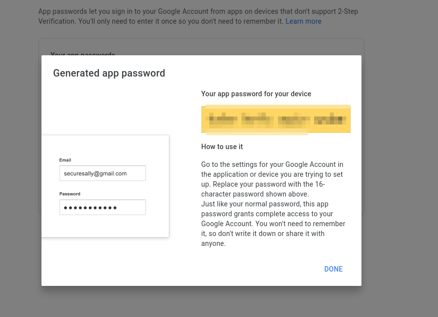

# open-liberty-email-sender
An example of using open liberty in a docker container to send emails
First, go to the `email-example/src/main/java/com/email/rest/RestApplication.java` file and fill in the respective values that I left as placeholders
You can tell if they are placeholder values if they are surrounded by <> characters.

The sender email needs to be a GMail account. To send emails, you need to fill in the `<sender email>` placeholder 
value with the sender's entire email. For the `<App password>` placeholder, the value will just be the email's
password if 2FA is not enabled on the account. If 2FA is enabled on the account, go the Google acocunts page app at
https://myaccount.google.com/?utm_source=OGB&utm_medium=app

In the searchbar, type in "App passwords" and select the menu that pops up. Select the app type as "Mail" and select the
device as "Other". You can name the device whatever you want. After doing so, a screen like this will pop up:

The code that is generated will go in the `<App password>` place holder.

To run this application, run `docker build . -t email-sender && docker run -d -p 9080:9080 -p 465:465 email-sender`
Once the application is up and running, send a post request to the route `http://localhost:9080/email-example/api/send`
and you will find that the `<receiver email>` will have received an email from `<sender email>`
